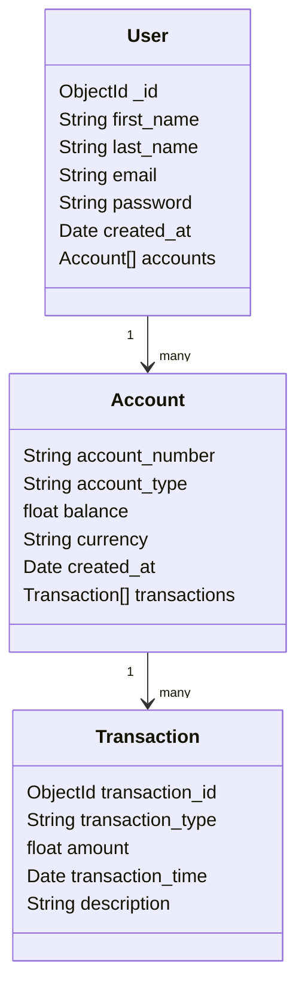

# Database schema design

The project will use a NoSQL database specifically MongoDB to store data.

Below are the design option considerations for the database design.

### Option 1: One collection to store all the data

The database would consist of one collection namely that will embed accounts and transactions to the customer data.

The collection name is:

- Users collection

A document in the collection would consist of the following fields:

- id
- first name
- last name
- email
- password
- created_at
- accounts

The accounts field will be an array with the following fields:

- account_number
- account_type
- balance
- currency
- created_at
- transactions

The transactions field will be an array including the following fields:

- transaction_id
- transaction_type
- amount
- transaction_time
- description

### Pros

- Embedding account and transactions data in one documents allows for quicker reads of customer data.
- Atomic updates as updates to the customer, accounts and transactions can be made in one atomic operation.

### Cons

- Documents can become too large with increasing accounts and transactions
- Retrieving large sets of account and transaction data becomes inefficient
- Concurrency bottlenecks as document updates occur

## Option 2 

The database will consist of three collections that will store customers, accounts and transaction data:

The collections will be named:

- Customers collection
- Accounts collection
- Transaction collection

The customers collection will store documents consisting of the following fields:

- id
- first name
- last name
- email
- password
- created_at

The accounts collection will store documents consisting of the following fields:

- id
- customer_id
- account_number
- account_type
- balance
- created_at

The transactions collection will store documents consisting of the following fields:

- id
- account_id
- transaction_type
- amount
- transaction_type

### Pros

- Scalability with increase in datasets will be much easier
- Query flexibility as transactions can be queried independent of customer
- Better concurrency management as transactions can be updated independent of customers

### Cons

- Increased complexity in querying account and transaction details in relation to customers
- Slower read operations as data is spread over different collections.
- Increased latency in write operations

## Decision

Option 2 will be used as it allows for easier scalability and ease of collection of data to train the fraud detection model.

The final database schema can be observed in the diagram below:

